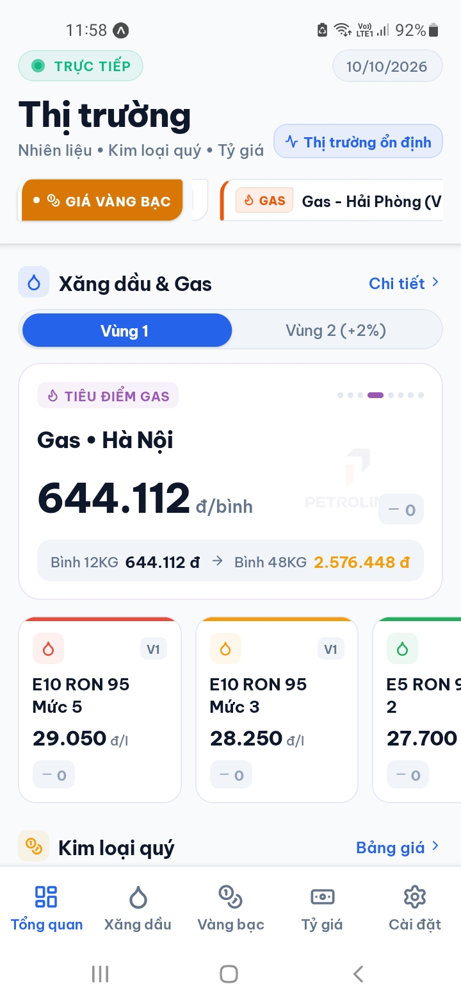
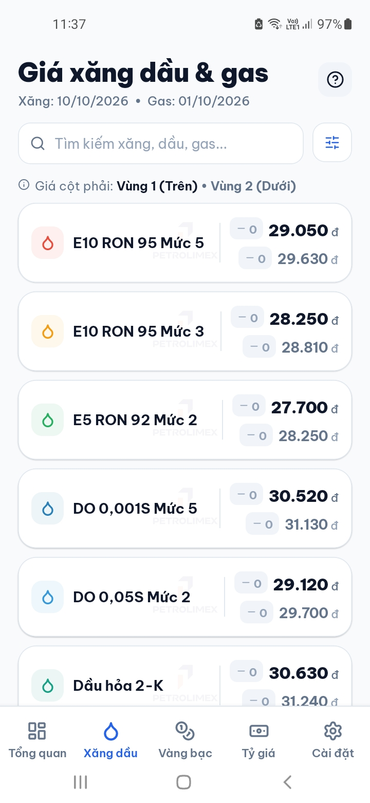
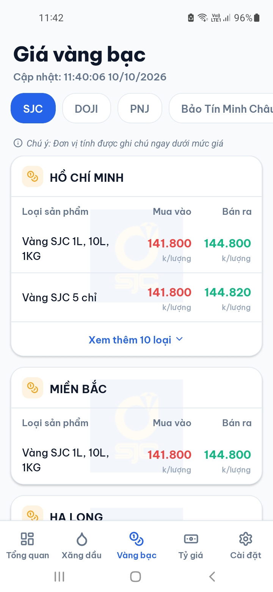
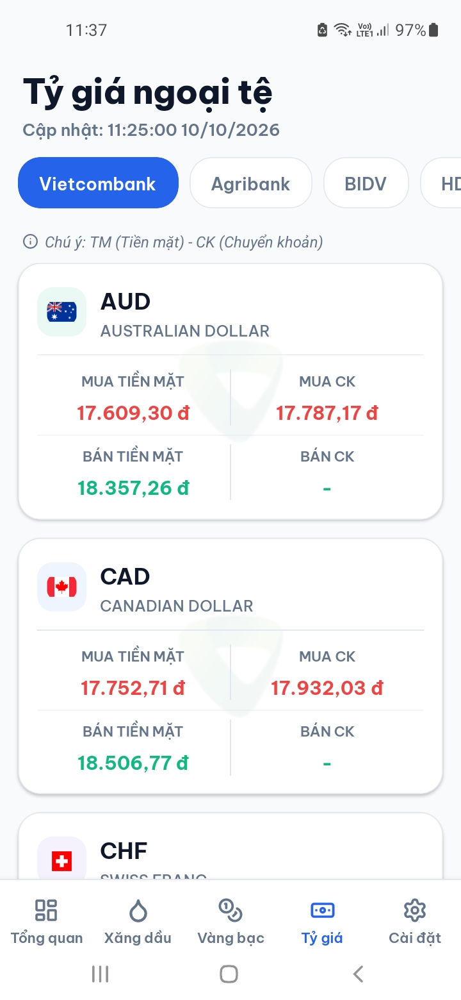
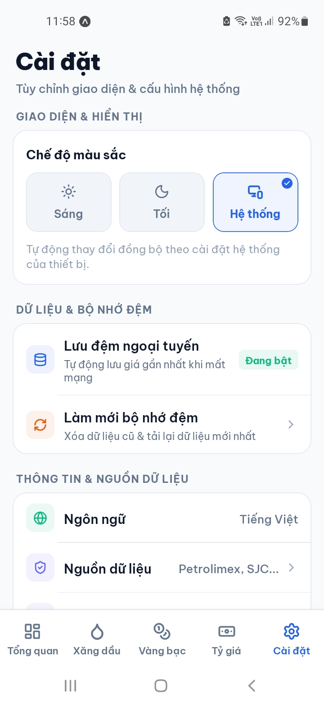

<div align="center">

  

  <h1>📊 Market App - Vietnam Market Tracker & Real-Time Price Hub</h1>
  <h3>Hệ thống Theo dõi & Cập nhật Giá cả Thị trường, Xăng dầu Petrolimex, Vàng bạc Kim loại quý & Tỷ giá Ngoại tệ Thời gian Thực</h3>

  <p>
    Ứng dụng di động hiện đại hỗ trợ người tiêu dùng và nhà đầu tư tra cứu biến động giá cả thị trường tại Việt Nam: 
    Cập nhật trực tiếp giá xăng dầu & khí đốt LPG từ Petrolimex, biến động giá vàng miếng & bạc Phú Quý 999 từ các thương hiệu lớn, 
    cùng bảng tỷ giá ngoại tệ đa ngân hàng thương mại với cơ chế lưu đệm Offline-First thông minh.
  </p>

  <p>
    
    
    
    
    
    
    
  </p>

</div>

<br />

---

## 📑 Mục lục

- [📱 Giới thiệu Dự án](#-giới-thiệu-dự-án)
- [🛠️ Công nghệ & Thư viện Cốt lõi](#️-công-nghệ--thư-viện-cốt-lõi)
- [🌟 Tính năng Nổi bật theo Màn hình](#-tính-năng-nổi-bật-theo-màn-hình)
  - [1. Màn hình Tổng quan Thị trường (`Dashboard`)](#1-màn-hình-tổng-quan-thị-trường-dashboard)
  - [2. Màn hình Xăng dầu & Khí đốt LPG (`GasPriceScreen`)](#2-màn-hình-xăng-dầu--khí-đốt-lpg-gaspricescreen)
  - [3. Màn hình Vàng bạc & Kim loại quý (`GoldPriceScreen`)](#3-màn-hình-vàng-bạc--kim-loại-quý-goldpricescreen)
  - [4. Màn hình Tỷ giá Ngoại tệ Ngân hàng (`ExchangeRateScreen`)](#4-màn-hình-tỷ-giá-ngoại-tệ-ngân-hàng-exchangeratescreen)
  - [5. Màn hình Cài đặt & Tùy biến (`SettingsScreen`)](#5-màn-hình-cài-đặt--tùy-biến-settingsscreen)
- [📸 Demo Giao diện Ứng dụng](#-demo-giao-diện-ứng-dụng)
- [🌐 Nguồn Dữ liệu & Cơ chế Đồng bộ](#-nguồn-dữ-liệu--cơ-chế-đồng-bộ)
- [📂 Cấu trúc Thư mục Dự án](#-cấu-trúc-thư-mục-dự-án)
- [🚀 Hướng dẫn Cài đặt & Khởi chạy](#-hướng-dẫn-cài-đặt--khởi-chạy)
- [👨‍💻 Tác giả & Giấy phép](#-tác-giả--giấy-phép)

---

## 📱 Giới thiệu Dự án

**Market App** là ứng dụng di động đa nền tảng (Android & iOS) được thiết kế nhằm mục đích mang lại cái nhìn toàn cảnh, chính xác và kịp thời nhất về các chỉ số giá cả thiết yếu tại thị trường Việt Nam:

1. **Xăng dầu & Khí đốt LPG:** Dữ liệu chuẩn xác trích xuất trực tiếp từ cổng điện tử Tập đoàn Xăng dầu Việt Nam (Petrolimex), phản ánh kỳ điều hành giá mới nhất của liên Bộ Công Thương - Tài chính cho cả **Vùng 1** và **Vùng 2**.
2. **Vàng bạc & Kim loại quý:** Tổng hợp bảng giá vàng SJC, DOJI, PNJ, Phú Quý, Bảo Tín Minh Châu, Mi Hồng... và đặc biệt hỗ trợ theo dõi biến động **Bạc Phú Quý 999** (Lượng & Kg).
3. **Tỷ giá Ngoại tệ Liên ngân hàng:** Tỷ giá giao dịch tiền mặt và chuyển khoản thời gian thực từ Vietcombank, Agribank, BIDV, HDBank, TPBank và Ngân hàng Nhà nước (NHNN).
4. **Trải nghiệm Hiện đại & Độc đáo:** Băng chuyền Ticker tin tức thời sự chuyển động liên tục với hình thù bất đối xứng (*Asymmetric Cyber-Fintech Shape*), giao diện tối giản chuẩn font **Be Vietnam Pro**, hỗ trợ Dark Mode và khả năng tự động khôi phục dữ liệu từ bộ nhớ đệm khi mất kết nối mạng.

---

## 🛠️ Công nghệ & Thư viện Cốt lõi

Ứng dụng được xây dựng trên nền tảng **React Native 0.81.5** và **Expo SDK 54**, kích hoạt sẵn kiến trúc mới (**React Native New Architecture - Fabric & TurboModules**):

### 🏗️ Core Mobile Stack

| Công nghệ | Phiên bản | Vai trò |
| :--- | :--- | :--- |
| **[Expo SDK](https://expo.dev/)** | `~54.0.33` | Nền tảng quản lý vòng đời ứng dụng, hỗ trợ cấu hình native và build tự động |
| **[React Native](https://reactnative.dev/)** | `0.81.5` | Framework phát triển ứng dụng di động đa nền tảng (`newArchEnabled: true`) |
| **[React](https://react.dev/)** | `19.1.0` | Thư viện giao diện React 19 với khả năng tối ưu render và memoization mạnh mẽ |
| **[TypeScript](https://www.typescriptlang.org/)** | `~5.9.2` | Ngôn ngữ tĩnh hóa mã nguồn, định kiểu an toàn 100% cho toàn bộ luồng dữ liệu |
| **[React Navigation](https://reactnavigation.org/)** | `^7.1.26` | Điều hướng Bottom Tabs v7 và Native Stack v7 mượt mà với Native Driver |

---

### 🎨 Design System, Typography & Animation

| Công nghệ | Phiên bản | Vai trò |
| :--- | :--- | :--- |
| **[Be Vietnam Pro](https://fonts.google.com/specimen/Be+Vietnam+Pro)** | `^0.4.1` | Bộ font chữ chuẩn hiển thị tiếng Việt hiện đại (Regular, Medium, SemiBold, Bold, ExtraBold) |
| **[Lucide React Native](https://lucide.dev/)** | `^0.563.0` | Hệ thống biểu tượng SVG sắc nét, đồng bộ (nghiêm cấm sử dụng emoji hội thoại) |
| **Custom Theme Engine** | `ThemeContext` | Hỗ trợ chuyển đổi mượt mà giữa chế độ Sáng (Light), Tối (Dark) và Theo hệ thống (System) |
| **Native Driver Animation** | `Animated API` | Xử lý hoạt họa băng chuyền Marquee, chuyển tab dạng Cross-fade đạt chuẩn 60fps |
| **Safe Area Context** | `~5.6.0` | Xử lý tràn viền Edge-to-Edge trên Android và an toàn tai thỏ / Dynamic Island trên iOS |

---

### 🌐 Networking, Scrapers & Offline Cache

| Công nghệ | Phiên bản | Vai trò |
| :--- | :--- | :--- |
| **[Axios](https://axios-http.com/)** | `^1.13.2` | Giao tiếp HTTP client tải dữ liệu API từ Petrolimex và các cổng tài chính |
| **[node-html-parser](https://www.npmjs.com/package/node-html-parser)** | `^7.0.1` | Bóc tách và xử lý cấu trúc HTML DOM siêu tốc từ các nguồn web giá vàng, tỷ giá |
| **AsyncStorage** | `2.2.0` | Bộ nhớ đệm cục bộ lưu trữ dữ liệu giá gần nhất và tùy chọn giao diện người dùng |
| **NetInfo** | `11.4.1` | Giám sát trạng thái kết nối mạng thời gian thực để chuyển đổi chế độ Online/Offline |
| **date-fns** | `^4.1.0` | Tiện ích chuẩn hóa và định dạng ngày tháng điều hành giá |

---

## 🌟 Tính năng Nổi bật theo Màn hình

### 1. Màn hình Tổng quan Thị trường (`Dashboard`)
* **Chyron Ticker Bất đối xứng (Asymmetric Cyber-Fintech Ticker):**
  - Cụm tiêu đề đầu Ticker tự động xoay vòng tiêu đề và đổi màu sắc sống động: `XĂNG DẦU 24H` (Cam), `GIÁ VÀNG BẠC` (Hổ phách), `TỶ GIÁ NGOẠI TỆ` (Xanh lục), `BIẾN ĐỘNG GIÁ` (Đỏ thời sự), `TIÊU ĐIỂM GIÁ` (Indigo).
  - Khối hình học bo góc chéo độc lạ (`borderTopLeftRadius: 13`, `borderBottomRightRadius: 13`), vạch nhấn màu công nghệ ở mép trái.
  - Kích thước thẻ trượt đồng bộ độ cao 38px, độ rộng thẻ 375px đảm bảo hiển thị trọn vẹn 100% tên mặt hàng trên 1 dòng duy nhất mà không bị cắt chữ.
  - Băng chuyền chuyển động liên tục không ngắt quãng (*Infinite Seamless Marquee Loop*).
* **Nhịp thở Thị trường (Market Breadth Sentiment):** Thống kê số lượng mặt hàng tăng giá / giảm giá trong ngày giúp người dùng nắm bắt nhanh xu hướng thị trường.
* **Tiêu điểm Xăng dầu & Gas Petrolimex:**
  - Nút gạt chọn Vùng 1 / Vùng 2 siêu gọn.
  - Thẻ tiêu điểm tự động luân phiên đổi phiên giữa Xăng RON 95 và Gas bình 12kg với hiệu ứng mờ dần chuyển tiếp.
* **Tiêu điểm Kim loại quý:** Hỗ trợ xem nhanh giá Vàng SJC, DOJI và Bạc Phú Quý 999.
* **Tỷ giá Ngoại tệ Nhanh:** Thẻ tỷ giá USD, EUR, GBP, JPY từ Vietcombank.

---

### 2. Màn hình Xăng dầu & Khí đốt LPG (`GasPriceScreen`)
* **Dữ liệu Chuẩn Petrolimex:** Phân định rõ ràng giá bán lẻ niêm yết tại **Vùng 1** (các tỉnh gần kho/cảng) và **Vùng 2** (vùng sâu, vùng xa, hải đảo).
* **Chỉ số Biến động Giá (+/-):** Tính toán độ chênh lệch giá so với kỳ điều chỉnh trước đó, hiển thị trực quan qua màu sắc (Xanh lá: Giảm giá, Đỏ: Tăng giá, Xám: Giữ nguyên).
* **Phân nhóm Toàn diện:**
  - Xăng sinh học & cao cấp: E10 RON 95, RON 95-V, RON 95-III, E5 RON 92-II.
  - Dầu động cơ: Dầu Điêzen DO 0,001S-V, DO 0,05S-II, Dầu hỏa 2-K, Dầu Mazut 180CST 3.5S.
  - Khí đốt hóa lỏng (LPG Petrolimex): Bình 12kg dân dụng, Bình 48kg công nghiệp (Hà Nội, TP.HCM, Đà Nẵng, Cần Thơ...).
* **Từ điển Quy chuẩn Vùng:** Modal tra cứu chi tiết địa danh thuộc Vùng 1 & Vùng 2 theo quyết định của Petrolimex.
* **Bộ lọc Thông minh:** Tìm kiếm nhanh theo tên mặt hàng hoặc lọc theo phân nhóm nhiên liệu.

---

### 3. Màn hình Vàng bạc & Kim loại quý (`GoldPriceScreen`)
* **Đa dạng Thương hiệu:** Hỗ trợ đầy đủ các thương hiệu kinh doanh vàng uy tín nhất Việt Nam:
  - Vàng Bạc Đá Quý Sài Gòn (**SJC**)
  - Tập Đoàn Vàng Bạc Đá Quý (**DOJI**)
  - Công Ty Cổ Phần Vàng Bạc Đá Quý Phú Nhuận (**PNJ**)
  - Tập Đoàn Vàng Bạc Đá Quý (**Phú Quý**)
  - Bảo Tín Minh Châu, Bảo Tín Mạnh Hải, Mi Hồng, Ngọc Thẩm.
* **Theo dõi Giá Bạc Phú Quý 999:** Cung cấp thông tin giá bạc 999 nguyên chất cho quy cách 1 Lượng, 10 Lượng và 1 Kg.
* **Bảng Giá Chi tiết Khu vực:** Tách biệt biểu giá theo từng thành phố (Hà Nội, TP. Hồ Chí Minh, Đà Nẵng, Cần Thơ, Hải Phòng...).
* **Bảng so sánh 2 chiều Mua vào - Bán ra:** Phản ánh biên độ chênh lệch giá (Spread) giúp nhà đầu tư tính toán điểm hòa vốn.

---

### 4. Màn hình Tỷ giá Ngoại tệ Ngân hàng (`ExchangeRateScreen`)
* **Hệ thống Ngân hàng Đa dạng:**
  - Ngân hàng TMCP Ngoại thương Việt Nam (**Vietcombank**)
  - Ngân hàng Nông nghiệp và Phát triển Nông thôn (**Agribank**)
  - Ngân hàng TMCP Đầu tư và Phát triển Việt Nam (**BIDV**)
  - Ngân hàng TMCP Phát triển TP.HCM (**HDBank**)
  - Ngân hàng TMCP Tiên Phong (**TPBank**)
  - Tỷ giá trung tâm do **Ngân hàng Nhà nước Việt Nam (NHNN)** công bố.
* **Ma trận Giao dịch 4 Cột Chuẩn mực:**
  - Mua tiền mặt (*Buy Cash*)
  - Mua chuyển khoản (*Buy Transfer*)
  - Bán tiền mặt (*Sell Cash*)
  - Bán chuyển khoản (*Sell Transfer*)
* **Hỗ trợ Đa Đồng tiền:** USD, EUR, GBP, JPY, AUD, SGD, THB, CAD, CHF, HKD, CNY, KRW... cùng thanh tìm kiếm tức thời.

---

### 5. Màn hình Cài đặt & Tùy biến (`SettingsScreen`)
* **Quản lý Chủ đề Giao diện (Theme Engine):**
  - **Sáng (Light Mode):** Tông màu trắng trang nhã, độ tương phản cao, dịu mắt ban ngày.
  - **Tối (Dark Mode):** Nền đen xám sâu bảo vệ mắt và tiết kiệm pin OLED ban đêm.
  - **Hệ thống (System Mode):** Tự động đồng bộ theo chế độ sáng/tối của thiết bị di động.
* **Thông tin Ứng dụng & Nguồn dữ liệu:** Minh bạch các liên kết nguồn và chính sách sử dụng dữ liệu thị trường.

---

## 📸 Demo Giao diện Ứng dụng

> *Ghi chú: Toàn bộ ảnh chụp màn hình thực tế được đặt tại thư mục `assets/screenshots/`.*

<div align="center">
  <table>
    <tr>
      <td align="center" width="50%">
        <b>1. Tổng quan Thị trường (Dashboard & Ticker)</b><br /><br />
        
      </td>
      <td align="center" width="50%">
        <b>2. Bảng giá Xăng dầu & Gas Petrolimex</b><br /><br />
        
      </td>
    </tr>
    <tr>
      <td align="center" width="50%">
        <b>3. Thị trường Vàng bạc & Kim loại quý</b><br /><br />
        
      </td>
      <td align="center" width="50%">
        <b>4. Tỷ giá Ngoại tệ Liên ngân hàng</b><br /><br />
        
      </td>
    </tr>
    <tr>
      <td align="center" colspan="2">
        <b>5. Cài đặt Giao diện & Chế độ Sáng / Tối</b><br /><br />
        
      </td>
    </tr>
  </table>
</div>

---

## 🌐 Nguồn Dữ liệu & Cơ chế Đồng bộ

```
[ Nguồn Trực Tuyến ]
 ├── Petrolimex Official API  ──> (Xăng dầu & Gas Vùng 1 / Vùng 2)
 ├── Giavang.org & Phú Quý   ──> (Vàng miếng SJC, DOJI & Bạc 999)
 └── Vietcombank XML & Baomoi ──> (Tỷ giá hối đoái ngân hàng)
                │
                ▼
     [ Tầng Xử lý Dữ liệu ]
 ├── Parser & Canonical Mapper (Chuẩn hóa tên gọi & giá trị tiền tệ)
 ├── NetInfo Check (Kiểm tra kết nối Internet)
 └── AsyncStorage (Lưu đệm Offline Cache)
                │
                ▼
     [ Giao diện Di động ]
 └── Cập nhật tức thời lên Dashboard, Danh mục & Băng chuyền Ticker
```

- **Chiến lược Offline-First:** Khi thiết bị mất sóng hoặc vào chế độ máy bay, ứng dụng tự động truy xuất bản lưu gần nhất trong `AsyncStorage`, đồng thời hiển thị huy hiệu thông báo trạng thái ngoại tuyến mà không gây treo ứng dụng.
- **Kéo xuống để Làm mới (Pull-to-Refresh):** Mọi màn hình danh mục đều hỗ trợ vuốt kéo làm mới dữ liệu với độ trễ tối ưu hóa vị trí Spinner bên dưới thanh trạng thái.

---

## 📂 Cấu trúc Thư mục Dự án

```text
Market-App/
├── assets/                    # Tài nguyên hình ảnh, biểu tượng và demo
│   ├── screenshots/           # Ảnh chụp màn hình giao diện ứng dụng
│   ├── logo-app.png           # Logo chính thức của ứng dụng
│   ├── icon.png               # Icon ứng dụng trên màn hình chủ
│   └── adaptive-icon.png      # Icon thích ứng cho nền tảng Android
├── src/
│   ├── components/            # Thành phần giao diện dùng chung & đặc thù
│   │   ├── common/            # Nút bấm, thanh trượt Segmented, huy hiệu Trend
│   │   │   ├── PressableCard.tsx
│   │   │   ├── SegmentedSlider.tsx
│   │   │   └── TrendBadge.tsx
│   │   ├── dashboard/         # Khối thành phần của màn hình Tổng quan
│   │   │   ├── ExchangeCardSection.tsx
│   │   │   ├── GasWidgetSection.tsx
│   │   │   ├── MarketHeader.tsx
│   │   │   ├── MarketMarquee.tsx      # Ticker thời sự bất đối xứng
│   │   │   ├── MarketPulseBar.tsx     # Nhịp thở thị trường
│   │   │   └── MetalsCardSection.tsx
│   │   ├── GasDetailModal.tsx # Hộp thoại chi tiết chỉ số xăng dầu
│   │   ├── GasFilterModal.tsx # Hộp thoại bộ lọc nhiên liệu
│   │   ├── GasItemCard.tsx    # Thẻ hiển thị giá xăng dầu & địa phương
│   │   └── ReferenceModal.tsx # Từ điển quy chuẩn Vùng 1 & Vùng 2
│   ├── constants/             # Hằng số định danh và danh mục địa lý
│   │   └── zoneData.ts
│   ├── navigation/            # Cấu hình thanh điều hướng Bottom Tab & Stack
│   │   └── AppNavigator.tsx
│   ├── screens/               # Các màn hình chính của ứng dụng
│   │   ├── DashboardScreen.tsx        # Màn hình Tổng quan
│   │   ├── GasPriceScreen.tsx         # Màn hình Xăng dầu & Gas
│   │   ├── GasDetailScreen.tsx        # Màn hình Chi tiết mặt hàng
│   │   ├── GoldPriceScreen.tsx        # Màn hình Vàng bạc kim loại quý
│   │   ├── ExchangeRateScreen.tsx     # Màn hình Tỷ giá ngoại tệ
│   │   └── SettingsScreen.tsx         # Màn hình Cài đặt
│   ├── services/              # Tầng gọi API và bóc tách dữ liệu
│   │   ├── exchangeService.ts         # Service bóc tách tỷ giá
│   │   ├── gasService.ts              # Service xử lý dữ liệu Petrolimex
│   │   └── metalService.ts            # Service xử lý giá vàng, giá bạc
│   ├── theme/                 # Quản lý màu sắc, kiểu chữ và chủ đề
│   │   ├── colors.ts
│   │   ├── ThemeContext.tsx           # Context cung cấp Light / Dark Mode
│   │   └── typography.ts              # Định nghĩa trọng số font Be Vietnam Pro
│   └── utils/                 # Hàm tiện ích tính toán và định dạng tiền tệ
│       └── helpers.ts
├── App.tsx                    # Điểm khởi động ứng dụng & nạp font chữ
├── app.json                   # Cấu hình thuộc tính ứng dụng Expo
├── index.js                   # Điểm đăng ký ứng dụng với React Native
├── package.json               # Danh mục thư viện phụ thuộc và mã lệnh npm
└── tsconfig.json              # Cấu hình trình biên dịch TypeScript
```

---

## 🚀 Hướng dẫn Cài đặt & Khởi chạy

### 1️⃣ Yêu cầu Hệ thống (Prerequisites)

* **Node.js:** `>= 18.18.0` (Khuyến nghị **Node.js 20.x** hoặc **22.x LTS**)
* **Trình quản lý gói:** `npm` (>= 9), `yarn`, `pnpm` hoặc `bun`
* **Công cụ chạy thử:**
  - Cài ứng dụng **Expo Go** trên điện thoại thật (Android / iOS).
  - Hoặc giả lập **Android Studio Emulator** / **Xcode Simulator** đã cài sẵn môi trường.

### 2️⃣ Clone Repository & Cài đặt Dependencies

```bash
# Clone mã nguồn về máy tính
git clone https://github.com/hvt299/Market-App.git

# Di chuyển vào thư mục dự án
cd Market-App

# Cài đặt các gói thư viện
npm install
```

### 3️⃣ Các Lệnh Thực thi (Scripts)

```bash
# Khởi chạy Metro Bundler môi trường phát triển
npm run start

# Chạy trực tiếp trên thiết bị hoặc máy ảo Android
npm run android

# Chạy trực tiếp trên máy ảo iOS (yêu cầu macOS)
npm run ios

# Kiểm tra an toàn kiểu dữ liệu TypeScript
npx tsc --noEmit

# Biên dịch gói Android tĩnh kiểm thử (Export Bundle)
npx expo export --platform android
```

Khi chạy `npm run start`, quét mã QR hiển thị trên Terminal bằng camera (đối với iOS) hoặc qua ứng dụng **Expo Go** (đối với Android) để bắt đầu trải nghiệm ứng dụng ngay lập tức.

---

## 👨‍💻 Tác giả & Giấy phép

Được phát triển và duy trì bởi **Mr.T (hvt299)**  
- **GitHub:** [https://github.com/hvt299](https://github.com/hvt299)
- **Repository:** [https://github.com/hvt299/Market-App](https://github.com/hvt299/Market-App)

*Dự án được xây dựng phục vụ mục đích theo dõi thông tin dân sinh và học tập nghiên cứu công nghệ React Native / Expo.*
